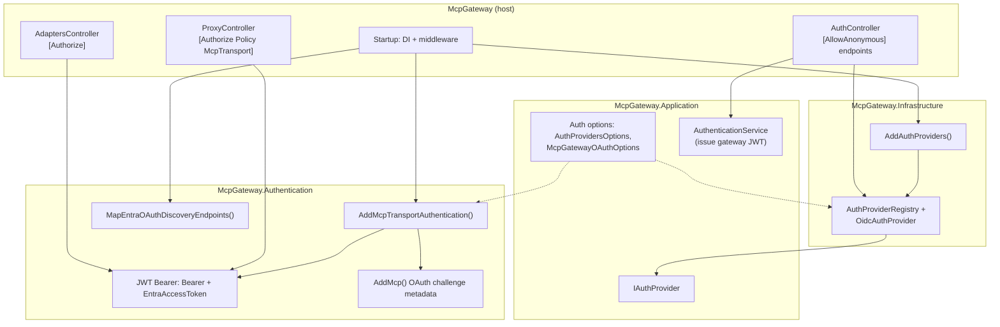
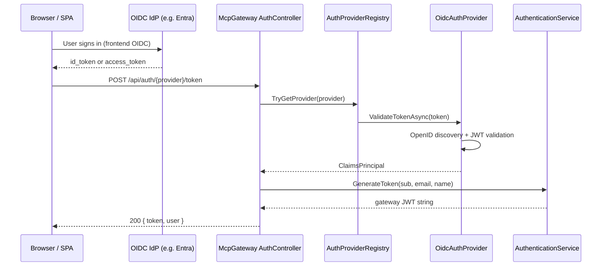
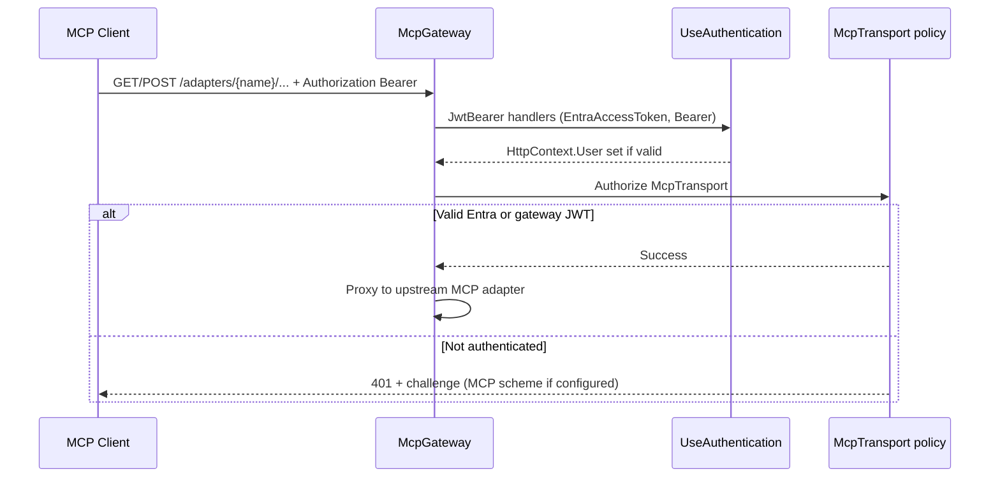

# MCP Gateway — Authentication

This document describes **how authentication works** in the MCP Gateway backend: which projects own what, how the SPA obtains a gateway token, how MCP clients authenticate to adapter routes, and where policies and configuration live.

---

## 1. Global picture

Authentication is split into **two complementary paths**:

| Path | Purpose | Typical caller |
|------|---------|----------------|
| **User / SPA login** | Exchange an OIDC token (from the browser) for a **gateway-signed JWT** used by your UI and admin APIs. | Angular app → `AuthController` |
| **MCP transport** | Accept **gateway JWT** and/or **Microsoft Entra access tokens** on `/adapters/...` and return RFC 9728-style challenges for MCP OAuth-aware clients. | Cursor, CLI, other MCP clients |

Both paths share the same **symmetric signing key** and issuer/audience settings under **`JWT:`** in configuration, but they use **different ASP.NET Core mechanisms** (manual validation in login vs. JWT bearer middleware for HTTP APIs).



---

## 2. Projects and responsibilities

| Project / area | Responsibility |
|----------------|----------------|
| **`McpGateway.Application/Auth`** | Options types (`AuthProvidersOptions`, `McpGatewayOAuthOptions`, `ProviderConfig`), `IAuthProvider`, `AuthenticationService` (mint gateway JWT after OIDC validation). No ASP.NET middleware. |
| **`McpGateway.Infrastructure`** | `AuthProviderRegistry`, `OidcAuthProvider` (OIDC discovery + token validation). `AddAuthProviders` registers options, registry, `AuthenticationService`, `IHttpClientFactory`. |
| **`McpGateway.Authentication`** | Transport auth: `AddJwtBearer` (gateway + optional Entra), `AddMcp` (protected-resource metadata), authorization policy **`McpTransport`**, JWT challenge hook for MCP metadata, optional Entra OIDC proxy / DCR shim endpoints. |
| **`McpGateway` (host)** | Composes: `AddAuthProviders`, `AddMcpTransportAuthentication`, `UseAuthentication` / `UseAuthorization`, `MapEntraOAuthDiscoveryEndpoints`, controllers. |

---

## 3. HTTP pipeline (order matters)

Configured in `Startup.Configure` (simplified):

1. `UseRouting`
2. `UseCors`
3. **`UseAuthentication`** — populates `HttpContext.User` from `Authorization: Bearer …` using registered schemes.
4. **`UseAuthorization`** — enforces `[Authorize]` / policies.
5. **`MapEntraOAuthDiscoveryEndpoints`** — minimal routes (e.g. `/.well-known/oauth-authorization-server`, `/oauth/register`, optional `/oauth2/authorize` and `/oauth2/token` proxies) when Entra metadata proxying is enabled.
6. `MapControllers` — MVC endpoints.

Anonymous endpoints: `GET /health`, `AuthController` actions marked `[AllowAnonymous]`, and the mapped OAuth discovery routes (anonymous by design).

---

## 4. Authentication schemes (ASP.NET Core)

Registered in `McpTransportAuthenticationWebRegistrar` (`McpGateway.Authentication`):

| Scheme | Constant / default name | Validates |
|--------|-------------------------|-----------|
| **Gateway JWT** | `JwtBearerDefaults.AuthenticationScheme` (`Bearer`) | Tokens issued by `AuthenticationService` (`JWT:Issuer`, `JWT:Audience`, symmetric `JWT:SecretKey`). |
| **Entra (MCP transport)** | `McpTransportAuthenticationSchemes.EntraAccessToken` (`EntraAccessToken`) | Microsoft Entra access tokens (authority + OIDC metadata, audiences from config — see §6). **Only registered** when `RegistersEntraJwtBearerForMcp` is true. |
| **MCP OAuth challenge** | `McpAuthenticationDefaults.AuthenticationScheme` | Not a JWT validator; used as **`DefaultChallengeScheme`** when MCP OAuth metadata is enabled so 401 responses include **RFC 9728**-style hints for MCP clients. |

**Default authenticate scheme** is always the **gateway** JWT bearer (`Bearer`), so `[Authorize]` without a policy uses that scheme for authentication.

---

## 5. Authorization policies

### 5.1 Named policy: `McpTransport`

Defined in `McpTransportAuthenticationWebRegistrar.AddAuthorizationPolicies`:

- **Name:** `McpTransportAuthorizationPolicy.Name` → `"McpTransport"`.
- **Requirement:** `RequireAuthenticatedUser()`.
- **Schemes:** If Entra JWT for MCP is registered → **`EntraAccessToken`** then **`Bearer`** (first successful principal wins). Otherwise → **`Bearer`** only.

Used by:

```csharp
[Authorize(Policy = McpTransportAuthorizationPolicy.Name)]
```

on `ProxyController` (all adapter proxy routes: SSE, streamable HTTP, messages).

### 5.2 Default `[Authorize]` (e.g. `AdaptersController`)

No custom policy name: ASP.NET Core’s **default authorization** for `[Authorize]` — user must be authenticated. With your setup, that means a valid **`Bearer`** token (gateway JWT), unless you change default schemes or policies globally.

---

## 6. Configuration reference

### 6.1 `JWT:` — gateway token signing (login + transport)

| Key | Role |
|-----|------|
| `JWT:SecretKey` | Symmetric key for signing/validating gateway JWTs. Required in non-development. |
| `JWT:Issuer` | Issuer claim (default `McpGateway`). |
| `JWT:Audience` | Audience claim (default `McpGateway`). |

Used by `AuthenticationService.GenerateToken` and by the **`Bearer`** JWT bearer handler.

### 6.2 `AuthProviders:` — SPA OIDC providers (login only)

Section **`AuthProviders`** (`AuthProvidersOptions.SectionName`), dictionary of named providers.

Each `ProviderConfig` includes `Enabled`, `Type` (e.g. `FrontendOidc`), `Authority`, `ClientId`, `SpaClientId`, etc. `AuthProviderRegistry` builds `OidcAuthProvider` instances for enabled providers.

**Azure AD block** used by MCP transport resolution: **`AuthProviders:AzureAd`** (`TenantId`, `ClientId`, `Authority`, `Enabled`, `SpaClientId`, …). `ResolvedMcpTransportAuthentication` reads this to decide whether to register **Entra** JWT bearer and to build **token audiences** for validation.

### 6.3 `Mcp:OAuth:` — MCP HTTP transport metadata & Entra workarounds

Bound to `McpGatewayOAuthOptions` (`SectionName` = `Mcp:OAuth`):

| Property | Effect (high level) |
|-----------|---------------------|
| `Enabled` | Master switch for MCP OAuth metadata path and Entra bearer registration (with Azure config). |
| `PublicBaseUrl` | Public base URL of the gateway for protected-resource metadata (important behind reverse proxies). |
| `ValidAudiences` / `ProtectedResourceIdentifier` | Extra allowed `aud` values for Entra tokens on MCP routes. |
| `AuthorizationServer` | Optional explicit authorization server issuer for metadata. |
| `ProxyEntraAuthorizationServerMetadata` | When true and issuer is Microsoft login, metadata can point clients at the gateway for discovery proxy. |
| `StripResourceOnAuthorizeRedirect` | Enables gateway `/oauth2/authorize` and `/oauth2/token` passthrough that strip `resource=` for Entra compatibility. |
| `DynamicClientRegistrationClientId` | Pre-registered client id returned by DCR shim when not using `SpaClientId`. |

Exact gating logic (when Entra bearer registers, when discovery endpoints map) is in `ResolvedMcpTransportAuthentication.Resolve`.

---

## 7. Flow A — SPA login (gateway JWT issuance)



- **Endpoints:** `GET /api/auth/config` (public), `POST /api/auth/{provider}/token` (public).
- **Output:** A **gateway JWT** the SPA stores and sends as `Authorization: Bearer <gateway-jwt>` to **`[Authorize]`** APIs (e.g. adapters CRUD).

---

## 8. Flow B — MCP client calls adapter routes



- **Challenge behavior:** For paths under `/adapters`, JWT bearer’s `OnChallenge` can delegate to the **MCP** authentication scheme so clients receive **`resource_metadata`** (see `JwtBearerEntraMcpChallengeExtensions`).

---

## 9. Optional Entra discovery / DCR shim (mapped routes)

When `MapEntraOAuthDiscoveryEndpoints` runs (`McpTransportAuthenticationRegistration`), the gateway may expose routes implemented in `EntraOAuthDiscoveryEndpointMapper`, including:

- **`GET /.well-known/oauth-authorization-server`** — proxy or transform Entra OIDC metadata (e.g. inject `registration_endpoint`).
- **`POST /oauth/register`** — RFC 7591-style shim returning a pre-registered `client_id`.
- **`GET /oauth2/authorize`** / **`POST /oauth2/token`** — optional passthrough that strips `resource=` for Entra when `StripResourceOnAuthorizeRedirect` is enabled.

These exist to support **MCP clients** that discover OAuth through the gateway while still obtaining tokens from Microsoft where appropriate.

---

## 10. Quick reference — controllers

| Controller | Attribute | Meaning |
|------------|-----------|---------|
| `ProxyController` | `[Authorize(Policy = McpTransportAuthorizationPolicy.Name)]` | **McpTransport** policy: Entra + gateway JWT when Entra is enabled; gateway only otherwise. |
| `AdaptersController` | `[Authorize]` | Any authenticated user via **default** scheme (**Bearer** / gateway JWT). |
| `AuthController` | `[AllowAnonymous]` on actions | Login and config without prior gateway session. |

---

## 11. File map (implementation entry points)

| Concern | Location |
|---------|----------|
| Host wiring | `backend/src/McpGateway/Startup.cs` |
| SPA token exchange | `backend/src/McpGateway/Controllers/AuthController.cs` |
| Adapter proxy | `backend/src/McpGateway/Controllers/ProxyController.cs` |
| Register OIDC providers + JWT minting services | `backend/src/McpGateway.Infrastructure/DependencyInjection/AuthProviderServiceCollectionExtensions.cs` |
| OIDC validation | `backend/src/McpGateway.Infrastructure/Auth/OidcAuthProvider.cs` |
| Issue gateway JWT | `backend/src/McpGateway.Application/Auth/AuthenticationService.cs` |
| Add transport auth + policy | `backend/src/McpGateway.Authentication/DependencyInjection/McpTransportAuthenticationServiceCollectionExtensions.cs` |
| JWT + MCP + policy registration | `backend/src/McpGateway.Authentication/Internal/McpTransportAuthenticationWebRegistrar.cs` |
| Resolve `JWT` / `Mcp:OAuth` / `AuthProviders:AzureAd` | `backend/src/McpGateway.Authentication/Internal/ResolvedMcpTransportAuthentication.cs` |
| Policy / scheme names | `backend/src/McpGateway.Authentication/TransportAuthenticationConstants.cs` |
| Discovery / DCR minimal APIs | `backend/src/McpGateway.Authentication/Internal/EntraOAuthDiscoveryEndpointMapper.cs` |
| MCP challenge on `/adapters` | `backend/src/McpGateway.Authentication/JwtBearerEntraMcpChallengeExtensions.cs` |

---

## 12. Mental model (one sentence)

**Login** turns an **external OIDC token** into a **gateway JWT** via `AuthController` + `OidcAuthProvider` + `AuthenticationService`. **MCP transport** accepts that **gateway JWT** and optionally **Entra access tokens** on **`ProxyController`**, guided by **`Mcp:OAuth`** metadata and the **`McpTransport`** authorization policy registered in **`McpGateway.Authentication`**.
